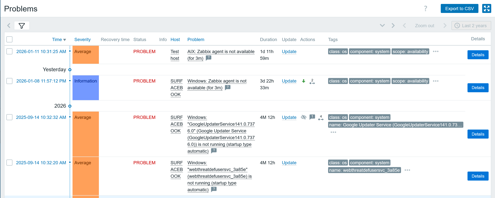
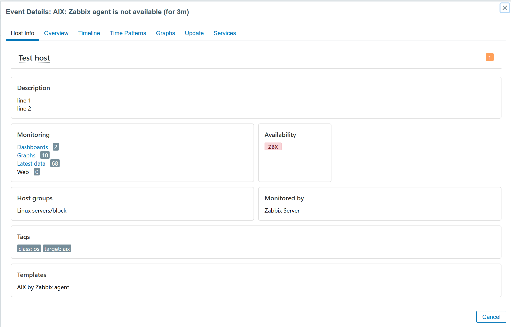
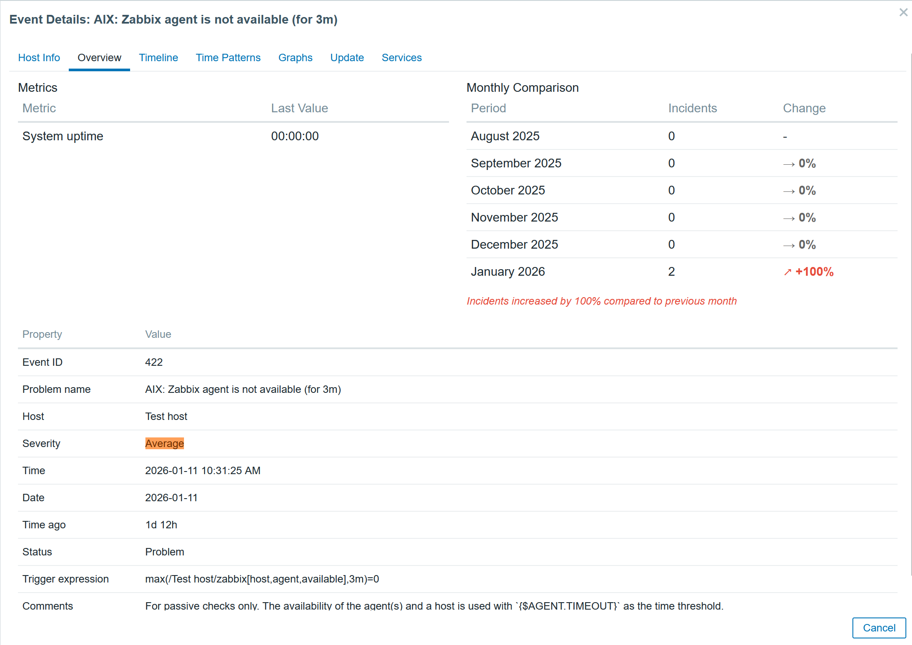
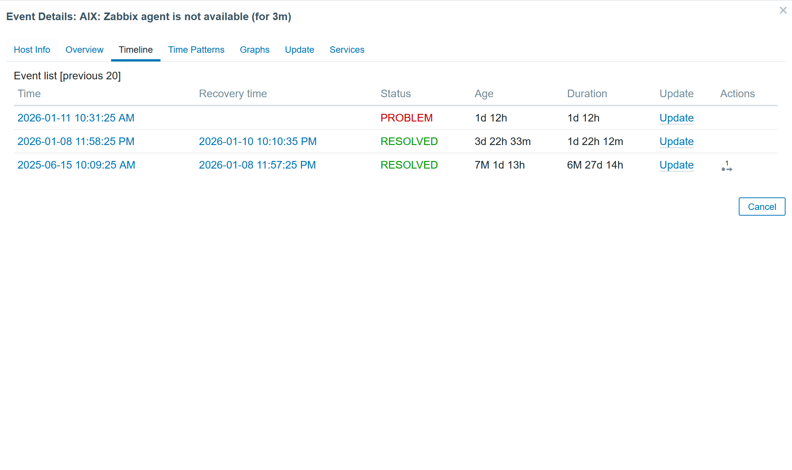
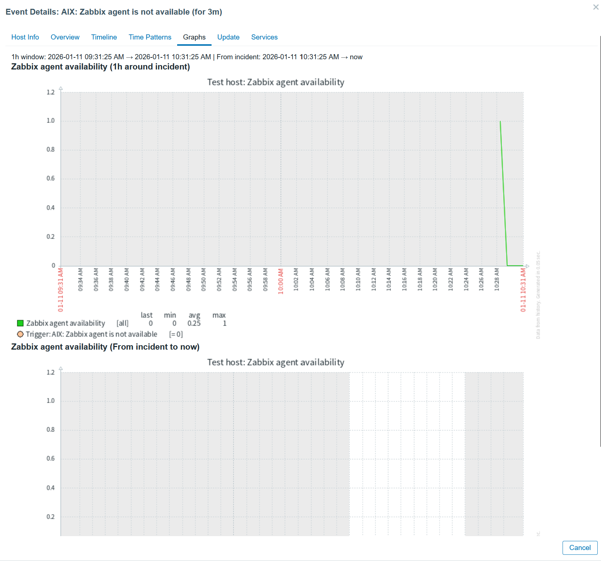
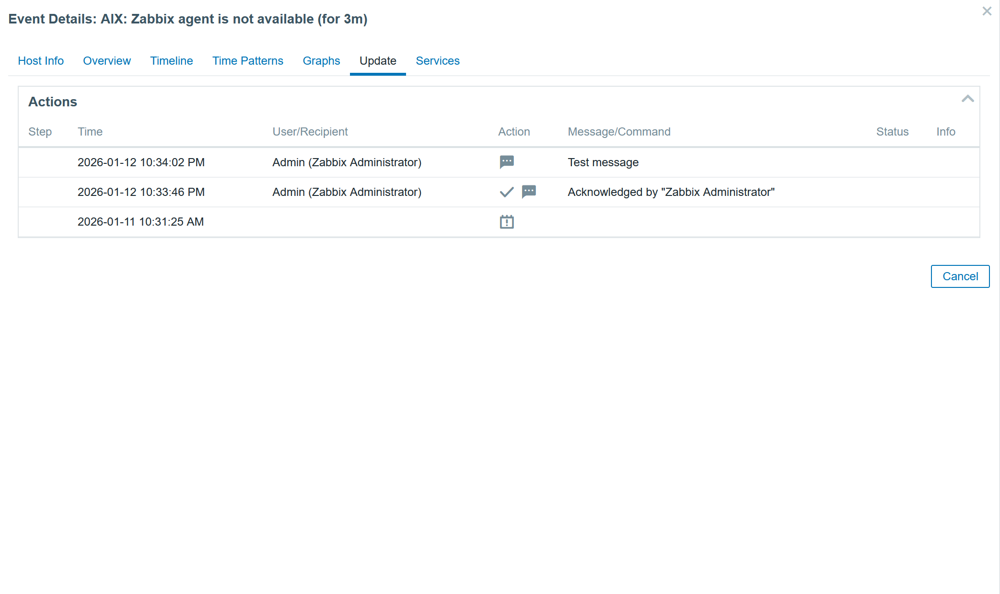
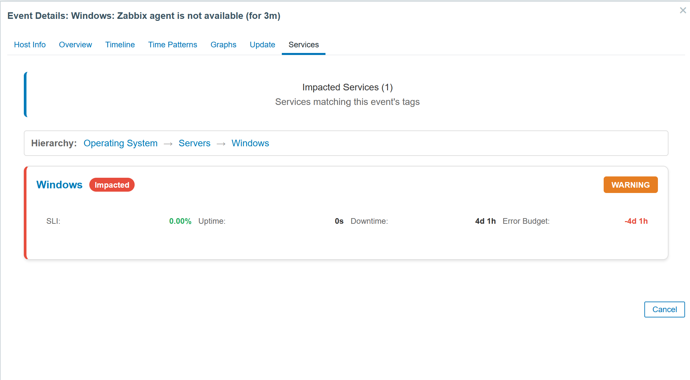

# **Zabbix Problem Analysis Module**

## This module was developed from version 7.0x.
## However, with some adjustments, it may be functional in other versions that support module deployment.
## To test in versions 6.0x, you need to change the manifest_version to 1.0.

This module provides a historical analysis of specific problems in Zabbix, offering a comparative report between the current and previous months. It helps users monitor issue trends and resolution efficiency.

## **Features**
- **Problem Summary**: Displays the total number of incidents recorded in the current and previous months.
- **Resolution Time**: Shows the average resolution time and highlights percentage changes.
- **Acknowledgment (ACK) Analysis**: Tracks the number of acknowledged events and their corresponding percentage.
- **Trend Indicators**: Uses color-coded arrows (green for improvement, red for deterioration) to indicate changes in key metrics.

## **Popup Tabs**
- **Host Info**: Host description plus monitoring/availability stats, host groups, monitored-by info, tags, templates, and inventory (when available).
- **Overview**: Event summary table (ID, name, host, severity, time, status, trigger details), optional agent metrics, and monthly incident comparison (last 6 months when available).
- **Timeline**: Zabbix event list for the previous 20 occurrences with native actions (acknowledge, severity change, close, etc.).
- **Time Patterns**: Extended section with interactive filter bar, incident heatmap (day x hour), and monthly drilldown (last 12 months). Hourly and weekly charts are shown below this section as collapsible panels (collapsed by default).
- **Graphs**: Consolidated charts for fixed windows (1 hour before incident to incident, and incident to now).
- **Update**: Full action history including acknowledgements, comments, suppress/unsuppress, severity changes, and recovery/manual-close entries.
- **Services**: Loads impacted services by matching event tags to service problem_tags and renders a service tree with a summary or a "no services" explanation.

## **Module Functionality**
- **Problem analysis popup**: Adds a dedicated event details popup with tabs for host context, timelines, patterns, graphs, updates, and impacted services.
- **Historical comparison**: Builds monthly incident comparisons for the same problem (last 6 months when available).
- **Pattern detection**: Aggregates related events to show hourly/weekday distributions, interactive heatmap filtering, and monthly/day drilldowns.
- **Time format behavior**: Time labels in patterns follow module behavior with 24h formatting where configured/expected.
- **Graph aggregation**: Pulls item data to show a compact set of charts around the incident window.
- **Service impact matching**: Uses event tags to find related services with matching `problem_tags`.

## **Example Report**
The image shows an analysis for the problem **"Event Details: AIX: Zabbix agent is not available (for 3m)"**, comparing last 6 months

This module enhances incident management by providing insights into recurring issues, resolution effectiveness, and acknowledgment rates.

